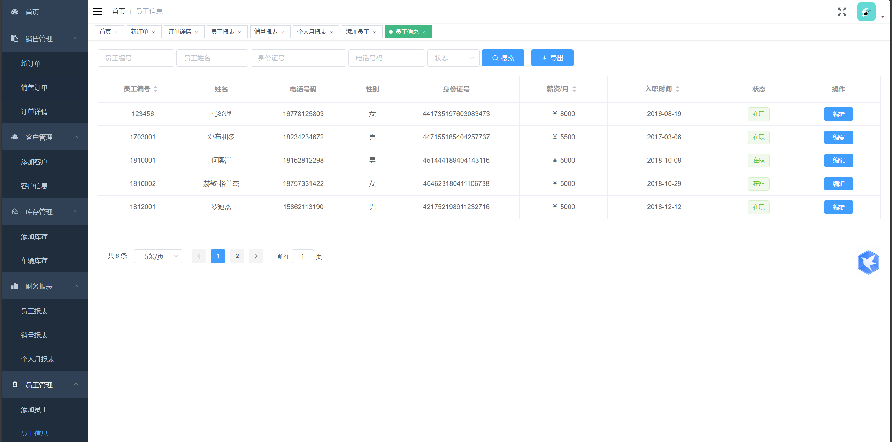

# spring boot + Vue 实现汽车销售管理系统

如需完整代码和SQl文件可+V : Ai1763591756（常年接毕设）

### 项目简介

本项目基于spring boot以及Vue开发，前端实现基于[PanJiaChen](https://github.com/PanJiaChen)所提供的开源后台项目[vue-element-admin](https://github.com/PanJiaChen/vue-element-admin)改造。

针对汽车销售提供客户信息、车辆信息、订单信息、销售人员管理、财务报表等功能，提供经理和销售两种角色进行管理。

### 食用指南
1. 导入carsale.sql到数据库中
2. 修改`src/resources/application.yml`的数据库连接信息
3. 启动CarsaleApplication，访问[localhost:8080](localhost:8080)

**食用指南PLUS（Vue项目启动）**

1. 安装好node环境
2. 在front目录下运行`npm install`安装所需要的包
3. 在front目录下运行`npm run dev`，访问[localhost:9527](localhost:9527)

```
npm config set strict-ssl false
```


```
npm install --registry=https://registry.npm.taobao.org
```

```
npm install 报错执行以下指令
git config --global http.sslverify "false"
git config --global url."https://".insteadOf git://

```

销售端主页：


统计报表：


销售财务报表：



